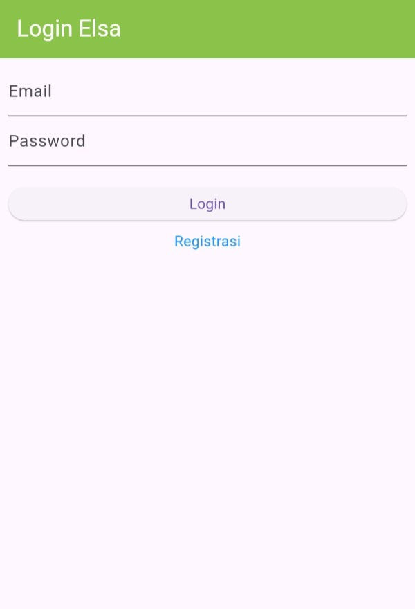
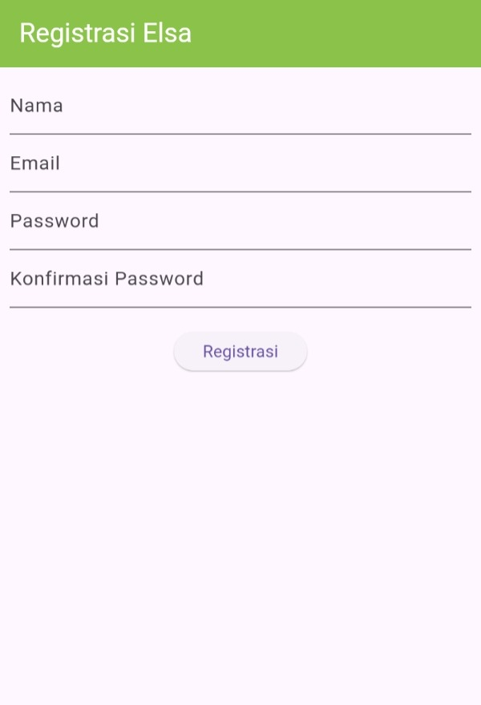
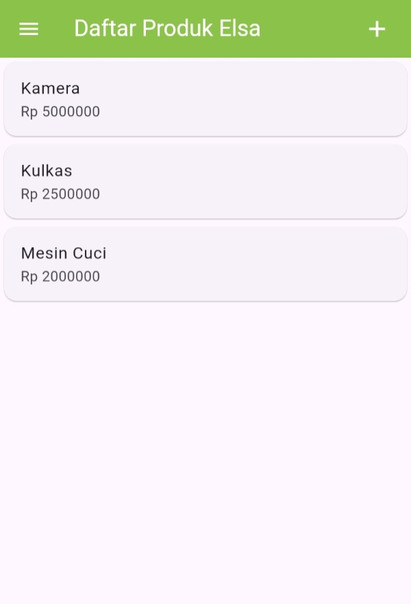
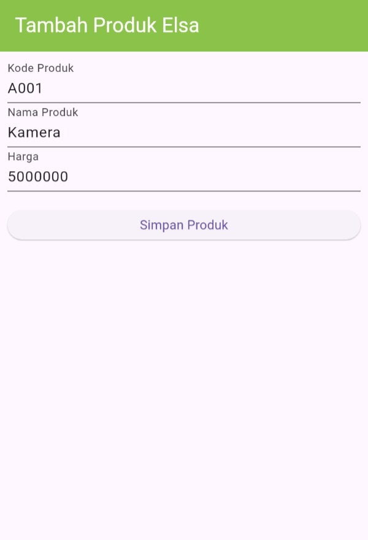
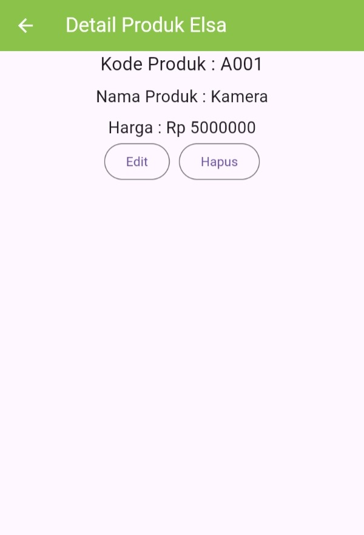

# Tokokita - Tugas Praktikum Pemrograman Mobile 
Aplikasi sederhana pengelolaan produk yang memiliki fitur login, register, dan CRUD produk.

Nama: Elsa Meilia Pusparani
NIM: H1D023092  
Shift Awal : C
Shift Baru : D

## Screenshot
### 1. Halaman Login

Halaman pertama yang akan dihadapkan kepada user, sebagai portal masuk ke aplikasi.

### 2. Halaman Register

Halaman untuk melakukan pendaftaran akun jika user belum memiliki akun. Dapat diakses melalui link 'Registrasi' yang ada pada halaman login.

### 3. Halaman Produk Page

Halaman yang akan menampilkan daftar produk yang ada pada aplikasi, ditampilkan dalam bentuk list. User bisa menekan produk yang diinginkan untuk melihat detail produk. Untuk menambah produk, user bisa menekan tombol tambah di pojok kanan atas (+). Ada juga side drawer yang menampilkan menu.

### 4. Halaman Produk Form

Halaman yang digunakan untuk menambah produk baru ke dalam aplikasi. User dipersilakan untuk mengisi semua kolom yang tersedia, lalu menekan tombol 'Simpan' untuk menyimpan produk dalam aplikasi.

### 5. Halaman Produk Detail

Halaman yang menampilkan detail lebih lanjut tentang produk. User juga dapat melakukan berbagai aksi, seperti 'Edit' yang akan mengarahkan pengguna ke form ubah produk, dan 'Hapus' yang akan mengarahkan pengguna ke pop up untuk konfirmasi menghapus produk dalam aplikasi.

## Penjelasan Kode

### Model
Model adalah representasi data yang digunakan dalam aplikasi. Setiap model memiliki struktur dan method untuk mengkonversi data JSON dari API menjadi objek Dart.

#### 1. login.dart
File model untuk menangani data hasil proses login. Model ini menerima response dari API login dan memprosesnya menjadi objek Login yang berisi:
- `code`: Kode status HTTP dari response API
- `status`: Status boolean keberhasilan login
- `token`: Token autentikasi yang diberikan setelah login berhasil
- `userID`: ID user yang berhasil login
- `userEmail`: Email user yang berhasil login

Model ini menggunakan factory constructor `fromJson()` untuk mengkonversi data JSON dari API menjadi objek Login. Terdapat pengecekan kondisi jika `code` bernilai 200 (berhasil), maka akan mengambil data token dan informasi user. Jika tidak, hanya akan menyimpan code dan status saja.

#### 2. produk.dart
File model untuk merepresentasikan data produk dalam aplikasi. Model Produk memiliki atribut:
- `id`: ID unik produk
- `kodeProduk`: Kode identifikasi produk
- `namaProduk`: Nama produk
- `hargaProduk`: Harga produk (menggunakan tipe dynamic untuk fleksibilitas)

Model ini juga dilengkapi dengan factory constructor `fromJson()` yang mengkonversi data JSON dari API menjadi objek Produk.

#### 3. registrasi.dart
File model untuk menangani data hasil proses registrasi user baru. Model Registrasi memiliki struktur sederhana dengan atribut:
- `code`: Kode status HTTP dari response API
- `status`: Status boolean keberhasilan registrasi
- `data`: Data pesan atau informasi tambahan dari proses registrasi

Model ini menggunakan factory constructor `fromJson()` untuk mengkonversi response JSON dari API registrasi menjadi objek Registrasi. 

### UI (User Interface)
UI adalah tampilan antarmuka pengguna yang dibangun menggunakan widget Flutter. Setiap halaman UI mengimplementasikan interaksi pengguna dan logika tampilan.

#### 1. login_page.dart
File halaman login yang menjadi gerbang masuk aplikasi. Halaman ini menggunakan `StatefulWidget` untuk mengelola state form login. Komponen utama:
- **Form dengan GlobalKey**: Untuk validasi input form
- **Email TextField**: Input untuk email user dengan validasi tidak boleh kosong
- **Password TextField**: Input untuk password dengan `obscureText: true` untuk menyembunyikan teks
- **Loading State**: Menampilkan `CircularProgressIndicator` saat proses login berlangsung
- **Link Registrasi**: InkWell widget yang mengarahkan ke halaman registrasi menggunakan `Navigator.push`

Halaman ini menggunakan `TextEditingController` untuk mengelola input dari user dan melakukan validasi sebelum proses login. Terdapat state `_isLoading` untuk mengontrol tampilan loading dan menonaktifkan tombol saat proses sedang berjalan.

#### 2. registrasi_page.dart
File halaman registrasi untuk user mendaftarkan akun baru. Halaman ini memiliki form yang lebih lengkap dibanding login. Komponen utama:
- **Nama TextField**: Input nama dengan validasi minimal 3 karakter
- **Email TextField**: Input email dengan validasi format email menggunakan RegEx pattern
- **Password TextField**: Input password dengan validasi minimal 6 karakter
- **Konfirmasi Password**: Input konfirmasi password yang harus sama dengan password pertama
- **Tombol Registrasi**: Button dengan loading indicator saat proses registrasi

Form dilengkapi dengan validator yang ketat untuk memastikan data yang diinput sesuai dengan requirement. Terdapat pengecekan format email yang valid dan pencocokan password dengan konfirmasi password.

#### 3. produk_page.dart
File halaman utama yang menampilkan daftar produk dalam bentuk list. Halaman ini adalah landing page setelah user berhasil login. Komponen utama:
- **AppBar dengan Action Button**: Tombol tambah (+) di pojok kanan atas untuk menambah produk baru
- **Drawer**: Side menu yang berisi opsi logout
- **ListView**: Menampilkan list produk menggunakan widget custom `ItemProduk`
- **ItemProduk Widget**: Widget stateless yang menerima parameter produk dan menampilkannya dalam Card dengan ListTile
- **GestureDetector**: Mendeteksi tap pada item produk untuk navigasi ke halaman detail

Saat ini halaman menggunakan data dummy (Kamera, Kulkas, Mesin Cuci) untuk menampilkan contoh produk. Setiap item produk dapat diklik untuk melihat detail.

#### 4. produk_form.dart
File halaman form untuk menambah atau mengubah data produk. Halaman ini dapat berfungsi ganda tergantung parameter yang diterima. Komponen utama:
- **Dynamic Title**: Judul berubah antara "Tambah Produk" atau "Ubah Produk" berdasarkan parameter
- **Kode Produk TextField**: Input kode produk dengan validasi tidak boleh kosong
- **Nama Produk TextField**: Input nama produk dengan validasi tidak boleh kosong
- **Harga Produk TextField**: Input harga dengan keyboard numerik dan validasi tidak boleh kosong
- **State Management**: Menggunakan `initState()` untuk menentukan mode (tambah/ubah)

Method `isUpdate()` mengecek apakah widget menerima parameter produk. Jika ya, maka form akan diisi dengan data produk tersebut dan berfungsi sebagai form edit. Jika tidak, form berfungsi untuk menambah produk baru.

#### 5. produk_detail.dart
File halaman detail produk yang menampilkan informasi lengkap sebuah produk. Halaman ini menerima parameter produk dari halaman sebelumnya. Komponen utama:
- **Display Information**: Menampilkan kode produk, nama produk, dan harga dalam format yang rapi
- **Tombol Edit**: Mengarahkan ke `ProdukForm` dengan parameter produk untuk mode edit
- **Tombol Hapus**: Menampilkan dialog konfirmasi sebelum menghapus produk
- **AlertDialog**: Dialog konfirmasi hapus dengan dua opsi "Ya" dan "Batal"

Halaman ini menggunakan widget Column untuk menampilkan informasi produk secara vertikal. Method `confirmHapus()` menampilkan dialog konfirmasi untuk memastikan user benar-benar ingin menghapus produk sebelum eksekusi.
