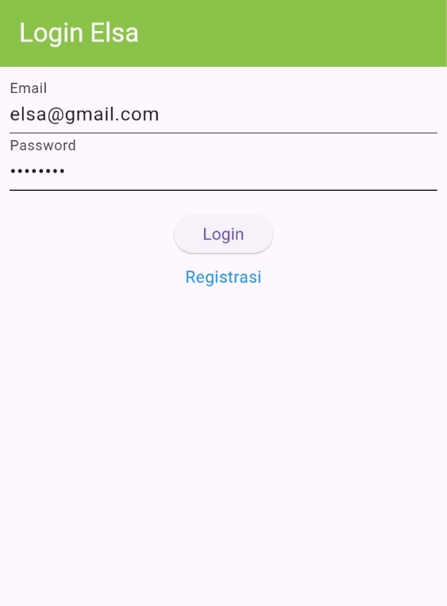
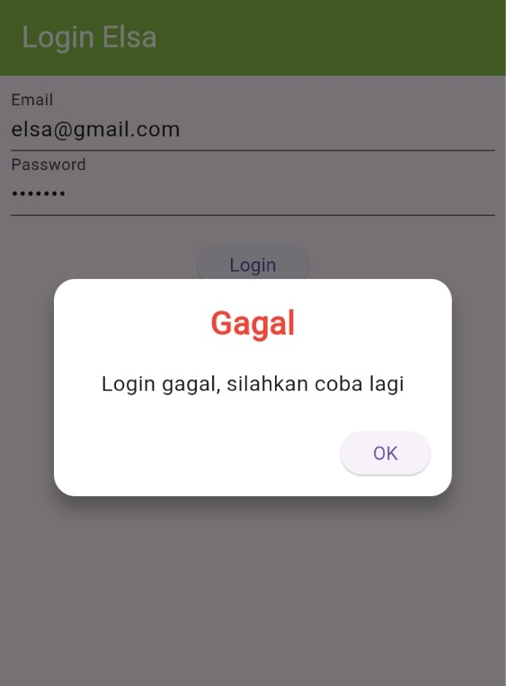
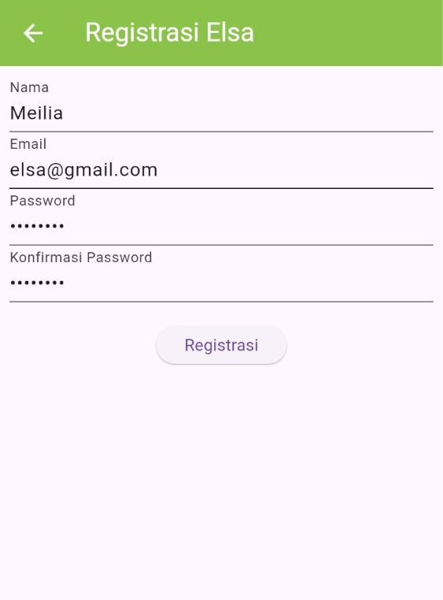
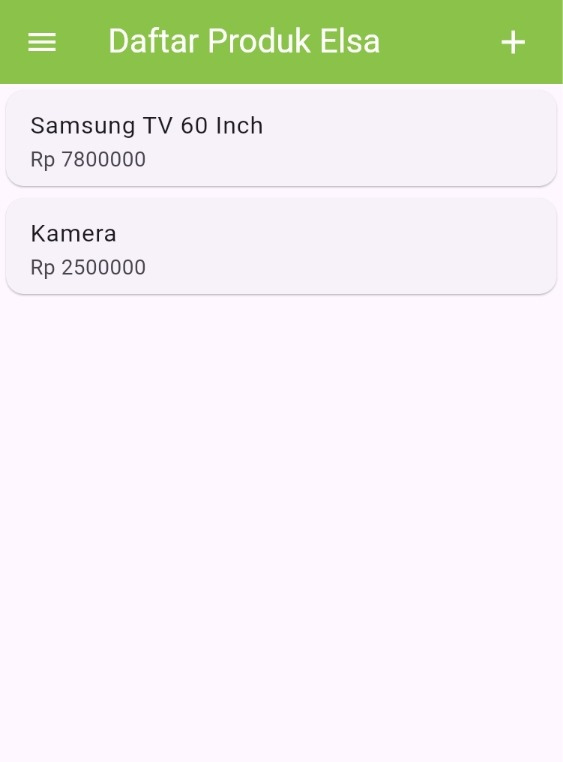
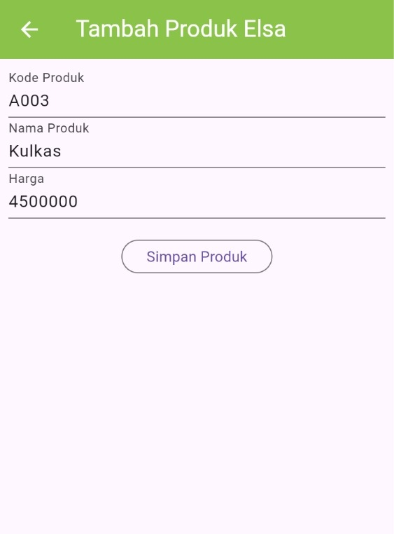
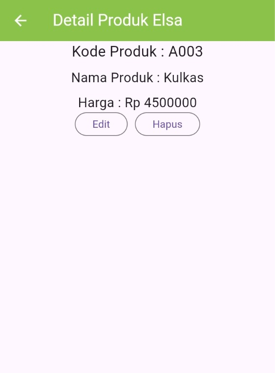
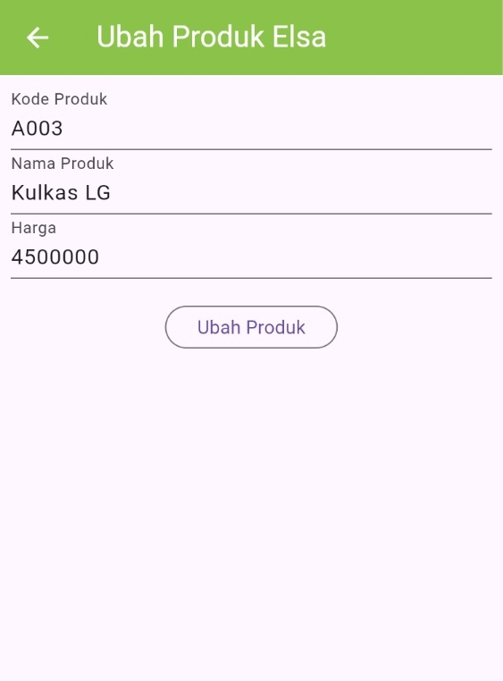
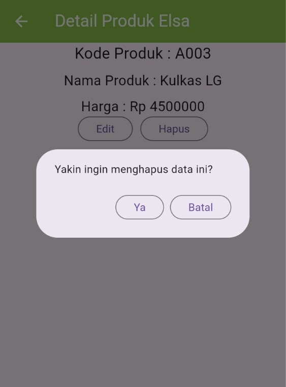

# Tokokita - Tugas Praktikum Pemrograman Mobile 
Aplikasi sederhana pengelolaan produk yang memiliki fitur login, register, dan CRUD produk. Aplikasi dibangun dengan menggunakan Flutter dan terintegrasi dengan API melalui CodeIgniter3.

```
Nama: Elsa Meilia Pusparani
NIM: H1D023092  
Shift Awal : C
Shift Baru : D
```

## Screenshot
### 1. Halaman Login
a. Form Login<br>

- Halaman pertama yang akan dihadapkan kepada user, sebagai portal masuk ke aplikasi. User mengisi kolom dengan email dan password yang telah didaftarkan. Jika user belum memiliki akun, silakan memilih menu registrasi.

b. Popup Gagal Login<br>

- Jika login berhasil, user akan diarahkan ke halaman produk. Jika gagal, akan muncul popup yang meminta user untuk mencoba lagi.

Kode dari `lib/ui/login_page.dart`: 
```dart
 void _submit() {
    _formKey.currentState!.save();
    setState(() {
      _isLoading = true;
    });
    LoginBloc.login(
      email: _emailTextboxController.text,
      password: _passwordTextboxController.text,
    ).then(
      (value) async {
        if (value.code == 200) {
          await UserInfo().setToken(value.token.toString());
          if (value.userID != null) {
            await UserInfo().setUserID(int.parse(value.userID.toString()));
          }
          Navigator.pushReplacement(
            context,
            MaterialPageRoute(builder: (context) => const ProdukPage()),
          );
        } else {
          showDialog(
            context: context,
            barrierDismissible: false,
            builder: (BuildContext context) => const WarningDialog(
              description: "Login gagal, silahkan coba lagi",
            ),
          );
        }
      },
      onError: (error) {
        print(error);
        showDialog(
          context: context,
          barrierDismissible: false,
          builder: (BuildContext context) => const WarningDialog(
            description: "Login gagal, silahkan coba lagi",
          ),
        );
      },
    );
    setState(() {
      _isLoading = false;
    });
  }
```

Pada kode di atas, fungsi `_submit()` ini menangani proses login dengan mengambil data email dan password dari form, lalu mengirimnya ke `LoginBloc`. Jika login berhasil, token dan user ID disimpan menggunakan `UserInfo`, kemudian user diarahkan ke halaman `ProdukPage`. Jika gagal—baik karena respons API tidak sesuai atau terjadi error—maka aplikasi menampilkan `WarningDialog`. Setelah proses selesai, indikator loading dimatikan kembali.


### 2. Halaman Registrasi
a. Form Registrasi<br>
<br>
Halaman untuk melakukan pendaftaran akun jika user belum memiliki akun. Dapat diakses melalui link 'Registrasi' yang ada pada halaman login.

b. Popup Berhasil Registrasi<br>
<br>
Jika berhasil, akan muncul popup yang menampilkan bahwa registrasi berhasil dan pengguna akan diarahkan untuk login.

Kode dari `lib/ui/registrasi_page.dart`:
```dart
void _submit(){
    _formKey.currentState!.save();
    setState(() {
      _isLoading = true;
    });
    RegistrasiBloc.registrasi(
      nama: _namaTextboxController.text,
      email: _emailTextboxController.text,
      password: _passwordTextboxController.text,
    ).then((value) {
      showDialog(
        context: context,
        barrierDismissible: false, builder: (BuildContext context) => SuccessDialog(
          description: "Registrasi berhasil, silahkan login",
          okClick: () {
            Navigator.of(context).pop();
          },
        )
      );
    }, onError: (error) {
      showDialog(
        context: context,
        barrierDismissible: false, builder: (BuildContext context) => WarningDialog(
          description: ("Registrasi gagal, silakan coba lagi"),
          okClick: () {
            Navigator.of(context).pop();
          },
        ),
      );
    });
    setState(() {
      _isLoading = false;
    });
  }
```

Pada kode di atas, fungsi `_submit()` digunakan untuk memproses form registrasi dengan cara menyimpan data input, menampilkan loading, lalu mengirim data ke API melalui `RegistrasiBloc`. Jika berhasil, aplikasi menampilkan `SuccessDialog`, dan jika gagal akan menampilkan `WarningDialog`. Setelah proses selesai, indikator loading dimatikan kembali.


### 3. Halaman Produk Page
<br>
Halaman yang akan menampilkan daftar produk yang ada pada aplikasi, ditampilkan dalam bentuk list. User bisa menekan produk yang diinginkan untuk melihat detail produk. Untuk menambah produk, user bisa menekan tombol tambah di pojok kanan atas (+). Ada juga side drawer yang menampilkan menu.

Kode dari `lib/ui/produk_page.dart`:
```dart
body: FutureBuilder<List>(
        future: ProdukBloc.getProduk(),
        builder: (context, snapshot){
          if (snapshot.hasError) print(snapshot.error);
          return snapshot.hasData
              ? ListProduk(list: snapshot.data)
              : const Center(child: CircularProgressIndicator());
    })
```

Potongan kode di atas menggunakan `FutureBuilder` untuk memanggil data produk dari `ProdukBloc.getProduk()`. Jika data berhasil di-load, widget akan menampilkan daftar produk melalui `ListProduk`. Jika data masih diproses, akan muncul indikator loading (`CircularProgressIndicator`). Jika terjadi error, error akan dicetak ke console.


### 4. Halaman Produk Form
<br>
Halaman yang digunakan untuk menambah produk baru ke dalam aplikasi. User dipersilakan untuk mengisi semua kolom yang tersedia, lalu menekan tombol 'Simpan' untuk menyimpan produk dalam aplikasi.

Kode dari `lib/ui/produk_form.dart`:
```dart
simpan() {
    setState(() {
      _isLoading = true;
    });
    Produk createProduk = Produk(id: null);
    createProduk.kodeProduk = _kodeProdukTextboxController.text;
    createProduk.namaProduk = _namaProdukTextboxController.text;
    createProduk.hargaProduk = int.parse(_hargaProdukTextboxController.text);
    ProdukBloc.addProduk(produk: createProduk).then(
      (value) {
        Navigator.of(context).push(
          MaterialPageRoute(
            builder: (BuildContext context) => const ProdukPage(),
          ),
        );
      },
      onError: (error) {
        showDialog(
          context: context,
          builder: (BuildContext context) => const WarningDialog(
            description: "Simpan gagal, silahkan coba lagi",
          ),
        );
      },
    );
    setState(() {
      _isLoading = false;
    });
  }
```

Pada kode di atas, fungsi `simpan()` digunakan untuk menambah data produk baru. Saat dipanggil, fungsi ini mengaktifkan indikator loading dan membuat objek `Produk` dari input pengguna. Data tersebut kemudian dikirim ke server melalui `ProdukBloc.addProduk()`. Jika berhasil, pengguna diarahkan kembali ke halaman daftar produk (`ProdukPage`). Jika terjadi error, sistem menampilkan dialog peringatan. Setelah proses selesai, status loading dimatikan kembali.


### 5. Halaman Produk Detail
a. Detail Produk<br>
<br>
Halaman yang menampilkan detail lebih lanjut tentang produk. User juga dapat melakukan berbagai aksi, seperti 'Edit' yang akan mengarahkan pengguna ke form ubah produk, dan 'Hapus' yang akan mengarahkan pengguna ke pop up untuk konfirmasi menghapus produk dalam aplikasi.

Kode dari `lib/ui/produk_detail.dart`:
```dart
body: Center(
        child: Column(
            children: [
              Text(
              'Kode Produk : ${widget.produk!.kodeProduk }',
              style: const TextStyle(fontSize: 20),
            ),
            const SizedBox(height: 8),
            Text(
              'Nama Produk : ${widget.produk!.namaProduk}',
              style: const TextStyle(fontSize: 18),
            ),
            const SizedBox(height: 8),
            Text(
              'Harga : Rp ${widget.produk!.hargaProduk.toString()}',
              style: const TextStyle(fontSize: 18),
            ),
            _tombolHapusEdit(),
          ],
        ),
      ),
```

Pada kode di atas, setiap atribut produk (`kodeProduk`, `namaProduk`, `hargaProduk`) diambil dari `widget.produk` dan di bagian akhir `_tombolHapusEdit()` dipanggil untuk menampilkan tombol aksi (edit/hapus).

b. Edit Produk<br>
<br>
Halaman yang menampilkan form untuk mengedit/mengubah produk yang telah disimpan sebelumnya.

Kode dari `lib/ui/produk_form.dart`:
```dart
ubah() {
    setState(() {
      _isLoading = true;
    });
    Produk updateProduk = Produk(id: widget.produk!.id!);
    updateProduk.kodeProduk = _kodeProdukTextboxController.text;
    updateProduk.namaProduk = _namaProdukTextboxController.text;
    updateProduk.hargaProduk = int.parse(_hargaProdukTextboxController.text);
    ProdukBloc.updateProduk(produk: updateProduk).then(
      (value) {
        Navigator.of(context).push(
          MaterialPageRoute(
            builder: (BuildContext context) => const ProdukPage(),
          ),
        );
      },
      onError: (error) {
        showDialog(
          context: context,
          builder: (BuildContext context) => const WarningDialog(
            description: "Permintaan ubah data gagal, silahkan coba lagi",
          ),
        );
      },
    );
    setState(() {
      _isLoading = false;
    });
  }
```

Pada kode di atas, fungsi `ubah()` digunakan untuk mengirim permintaan update data produk. Fungsi ini pertama-tama mengaktifkan indikator loading dengan `setState`. Kemudian membuat objek `Produk` baru dengan `id` produk yang sedang diedit, lalu mengisi nilai terbaru dari controller input. Data tersebut dikirim ke server melalui `ProdukBloc.updateProduk()`. Jika permintaan berhasil, halaman dialihkan kembali ke `ProdukPage`; jika gagal, ditampilkan `WarningDialog`. Di akhir fungsi, loading dinonaktifkan kembali dengan `setState`.

c. Hapus Produk<br>
<br>
Tombol ini akan mengarahkan user kepada dialog/popup untuk konfimasi apakah user yakin untuk menghapus produk. Jika user mengklik `Ya`, produk akan dihapus. Jika user mengklik `Batal`, user akan diarahkan kembali ke detail produk.

Kode dari `lib/ui/produk_detail.dart`:
```dart
void confirmHapus() {
    AlertDialog alertDialog = AlertDialog(
      content: const Text("Yakin ingin menghapus data ini?"),
      actions: [
        OutlinedButton(
          child: const Text("Ya"),
          onPressed: () {
            ProdukBloc.deleteProduk(id: int.parse(widget.produk!.id!))
                .then((value) {
                  Navigator.of(context).push(
                    MaterialPageRoute(builder: (context) => const ProdukPage()),
                  );
                })
                .catchError((error) {
                  showDialog(
                    context: context,
                    builder: (BuildContext context) => const WarningDialog(
                      description: "Hapus gagal, silahkan coba lagi",
                    ),
                  );
                });
          },
        ),
        OutlinedButton(
          child: const Text("Batal"),
          onPressed: () => Navigator.pop(context),
        ),
      ],
    );
    showDialog(builder: (context) => alertDialog, context: context);
  }

```

Berikut penjelasan teknis singkatnya:

Pada kode di atas, fungsi `confirmHapus()` menampilkan dialog konfirmasi sebelum menghapus data produk. Ketika tombol **"Ya"** ditekan, fungsi memanggil `ProdukBloc.deleteProduk()` dengan ID produk yang dipilih. Jika penghapusan berhasil, halaman dialihkan kembali ke `ProdukPage`. Jika terjadi error, sistem menampilkan `WarningDialog`. Setelah memulai proses hapus, dialog ditutup dengan `Navigator.pop(context)`. Tombol **"Batal"** hanya menutup dialog tanpa melakukan apa pun.


## Penjelasan Kode
### Arsitektur Singkat
Aplikasi mengikuti pola sederhana: UI (Widget) memanggil layer Bloc statis → Bloc memanggil helper API (`Api`) → Helper melakukan HTTP request ke endpoint yang didefinisikan di `ApiUrl` → Response JSON diubah menjadi Model (Login, Registrasi, Produk) → Hasil dikembalikan ke UI untuk ditampilkan atau diproses lanjut. Informasi sesi (token & userID) disimpan lewat `UserInfo` (SharedPreferences).

### Alur Autentikasi
1. User mengisi form login → `LoginBloc.login()` mengirim `email` & `password` via POST.
2. Response berstatus 200 akan membawa `token` dan data user; token disimpan oleh `UserInfo`.
3. Token (Bearer) dipakai untuk request terproteksi (produk). Pastikan backend benar-benar menggunakan header Authorization.
4. Logout cukup memanggil `LogoutBloc.logout()` yang melakukan `prefs.clear()`.

### Model
Representasi data dari server. Setiap model punya factory `fromJson()` untuk memetakan struktur response.

#### login.dart
- Menyimpan hasil operasi login: `code`, `status`, `token`, `userID`, `userEmail`.
- Jika `code == 200`, mengambil nested field `data.token` dan `data.user`.
- Catatan: Pastikan tipe `id` dari server konsisten (string vs int). Jika API mengirim integer, aman menggunakan `int.parse(obj['data']['user']['id'].toString())`.

#### produk.dart
- Properti: `id`, `kodeProduk`, `namaProduk`, `hargaProduk`.
- Factory membaca field JSON: `id`, `kode_produk`, `nama_produk`, `harga`.
- Tipe `hargaProduk` dibuat dinamis agar fleksibel (int/double/string). Disarankan seragamkan jadi `int` atau `double` di backend untuk konsistensi.

#### registrasi.dart
- Properti sederhana: `code`, `status`, `data` (biasanya pesan sukses/gagal).
- Tidak ada nested parsing kompleks; langsung mapping satu tingkat.

### Helper & Infrastruktur

#### api_url.dart
- Menyimpan base path dan endpoint: `login`, `registrasi`, serta kumpulan endpoint CRUD produk.
- Jika pakai Android Emulator untuk mengakses server lokal, ganti `localhost` menjadi `10.0.2.2`.

#### user_info.dart
- Abstraksi SharedPreferences untuk menyimpan `token` dan `userID`.
- Metode `logout()` melakukan `clear()` sehingga seluruh sesi terhapus.

#### api.dart
- Wrapper HTTP (`package:http`). Metode: `post`, `get`, `put`, `delete`.
- Menambahkan header Authorization Bearer jika token ada.
- Mengembalikan `response.body` hanya untuk status 200 (atau bisa diperluas untuk 201/204 sesuai kebutuhan backend).
- Menangani error via exception khusus: `FetchDataException`, `BadRequestException`, `UnauthorisedException`, dll.

### Bloc Layer
Menyediakan fungsi statis agar UI tidak langsung bergantung pada detail request.

#### LoginBloc
- Menyiapkan body `{email, password}` dan memanggil `Api().post` ke endpoint login.
- Mengubah JSON menjadi instance `Login`.

#### RegistrasiBloc
- Mengirim `{nama, email, password}` ke endpoint registrasi.
- Mengubah JSON menjadi `Registrasi` untuk feedback ke UI.

#### ProdukBloc
- `getProduk()`: GET daftar produk, memetakan list `data` menjadi List<Produk>.
- `addProduk()`: POST produk baru (pastikan key harga sinkron dengan backend: `harga` vs `harga_produk`).
- `updateProduk()`: PUT produk berdasarkan ID.
- `deleteProduk()`: DELETE produk berdasarkan ID dan mengembalikan status (boolean atau asumsi sukses jika body kosong).

#### LogoutBloc
- Memanggil `UserInfo().logout()` untuk hapus sesi.

### UI (User Interface)
Widget layar memegang validasi form, state loading, navigasi, dan memanggil Bloc.

#### login_page.dart
- Form dengan field email + password dan tombol Login.
- Memanggil `_submit()` → menyalakan loading → memanggil `LoginBloc.login()` → simpan token → navigasi ke Produk.
- Menampilkan dialog kesalahan jika login gagal.

#### registrasi_page.dart
- Form lengkap: nama, email (RegEx), password, konfirmasi password.
- Memanggil `_submit()` → kirim ke `RegistrasiBloc.registrasi()` → dialog sukses atau gagal.

#### produk_page.dart
- Menggunakan `FutureBuilder` untuk memuat produk sekali saat build.
- Drawer menyediakan logout (clear sesi token) dan kembali ke login.
- Tombol tambah (+) membuka `ProdukForm`.

#### produk_form.dart
- Mode Tambah vs Ubah ditentukan oleh apakah ada `produk` yang dikirim lewat konstruktor.
- Fungsi `simpan()` dan `ubah()` merekayasa objek `Produk` lalu kirim ke Bloc.
- Navigasi kembali ke `ProdukPage` setelah operasi.

#### produk_detail.dart
- Menampilkan detail produk dan menyediakan aksi Edit serta Hapus.
- Hapus memunculkan dialog konfirmasi sebelum memanggil `ProdukBloc.deleteProduk()`.
